# Swappable Architecture Components

You've identified the **5 key modular components** perfectly! Each is independently swappable.

## Architecture Overview

```mermaid
flowchart LR
    Pipeline["1. Holoscan Pipeline
    (Data Generation)"]
    
    Serialize["2. Message Serialization
    (Encoding)"]
    
    Logger["3. DataLogger
    (Transport)"]
    
    Deserialize["4. Message Deserialization
    (Decoding)"]
    
    Viz["5. Visualization
    (Display)"]
    
    Pipeline -->|Tensor objects| Serialize
    Serialize -->|Binary/text| Logger
    Logger -->|Wire protocol| Deserialize
    Deserialize -->|Numpy arrays| Viz
    
    style Pipeline fill:#e1f5ff
    style Serialize fill:#fff3e1
    style Logger fill:#f0e1ff
    style Deserialize fill:#fff3e1
    style Viz fill:#e1ffe8
```



## Component 1: Holoscan Pipeline (Data Generation)

**Purpose:** Generate data to visualize

**Interface:** Emits Holoscan `Tensor` or `TensorMap` objects

### Current Implementation

```python
class SourceIsingOp(Operator):
    def compute(self, op_input, op_output, context):
        # Generate 64×64 Ising model data
        spin_config = ...  # np.ndarray
        op_output.emit(dict(spins=as_tensor(spin_config)), "out")
```

### Alternative Options

| Implementation | Data Type | Complexity | Use Case |
|----------------|-----------|------------|----------|
| **Sine wave generator** ✓ | 1D float32 | Simple | Time series |
| **Ising model** ✓ | 2D float32 | Medium | Physics sim |
| **Video stream** | 3D uint8 (H×W×C) | Medium | Camera feed |
| **Sensor fusion** | Multiple tensors | Complex | Multi-modal |
| **Medical imaging** | 3D/4D float32 | Complex | CT/MRI scans |
| **Point cloud** | Nx3 float32 | Medium | LiDAR data |

**Swappability:** Replace `SourceIsingOp` with any operator that emits tensors

---

## Component 2: Message Serialization (Encoding)

**Purpose:** Convert C++ Tensor → wire format bytes

**Interface:** `Tensor/TensorMap` → `bytes`

### Current Implementation

```cpp
// FlatBuffers serialization
flatbuffers::FlatBufferBuilder builder;
auto tensor_fb = create_tensor(builder, tensor);
auto message = CreateMessage(builder, unique_id, io_type, timestamp, tensor_fb);
builder.Finish(message);
bytes = builder.GetBufferPointer();
```

### Alternative Options

| Format | Size Overhead | Speed | Zero-Copy | Language Support |
|--------|---------------|-------|-----------|------------------|
| **FlatBuffers** ✓ | Minimal | Very Fast | Yes | Excellent |
| **Protocol Buffers** | Small | Fast | No | Excellent |
| **MessagePack** | Small | Fast | No | Good |
| **JSON** | Large (~30%) | Slow | No | Universal |
| **Cap'n Proto** | Minimal | Very Fast | Yes | Good |
| **Custom binary** | Minimal | Very Fast | Possible | DIY |
| **NumPy .npy** | Small | Fast | No | Python-focused |
| **HDF5** | Small | Medium | Partial | Good |

**Example Swap: JSON**

```python
# Serialization
msg = {
    'unique_id': 'source.out',
    'timestamp': timestamp,
    'tensor': {
        'data': base64.b64encode(array.tobytes()).decode(),
        'shape': array.shape,
        'dtype': str(array.dtype)
    }
}
bytes = json.dumps(msg).encode()
```

**Swappability:** Change `AsyncNatsBackend::process_data_entry()` to use different serializer

---

## Component 3: DataLogger (Transport)

**Purpose:** Send serialized data somewhere

**Interface:** `bytes` → destination

### Current Implementation

```cpp
// NATS publish
natsConnection_Publish(
    nc,
    subject.c_str(),
    bytes,
    bytes_length
);
```

### Alternative Options

| Transport | Latency | Throughput | Persistence | Use Case |
|-----------|---------|------------|-------------|----------|
| **NATS** ✓ | Very Low | High | Optional | Real-time streaming |
| **NATS JetStream** | Low | High | Yes | Streaming + replay |
| **Kafka** | Low | Very High | Yes | Event streaming |
| **Redis Streams** | Very Low | High | Yes | Real-time + history |
| **ZeroMQ** | Very Low | Very High | No | In-process/IPC |
| **WebSocket** | Low | Medium | No | Browser clients |
| **File (local)** | High | Medium | Yes | Offline analysis |
| **File (network)** | High | Low | Yes | Shared storage |
| **Database** | High | Low | Yes | Long-term storage |
| **HTTP/REST** | Medium | Low | No | Simple integrations |
| **gRPC** | Low | High | No | Service-to-service |
| **Console/stdout** | N/A | N/A | No | Debugging |

**Example Swap: Kafka**

```cpp
// Kafka producer (instead of NATS)
rd_kafka_produce(
    rk_topic,
    RD_KAFKA_PARTITION_UA,
    RD_KAFKA_MSG_F_COPY,
    bytes, bytes_length,
    key, key_len,
    nullptr
);
```

**Example Swap: File**

```cpp
// Write to file (instead of NATS)
std::ofstream file("data.bin", std::ios::binary | std::ios::app);
file.write(reinterpret_cast<const char*>(bytes), bytes_length);
```

**Swappability:** Replace `NatsLogger` with `KafkaLogger`, `FileLogger`, etc.

**Note:** This is what the DataLoggerResource abstraction enables!

---

## Component 4: Message Deserialization (Decoding)

**Purpose:** Convert wire format bytes → Python objects

**Interface:** `bytes` → numpy arrays

### Current Implementation

```python
# FlatBuffers deserialization
fb_msg = Message.Message.GetRootAs(bytes, 0)
unique_id = fb_msg.UniqueId().decode()
tensor_fb = fb_msg.Payload()

# Convert to numpy (zero-copy!)
raw_data = tensor_fb.DataAsNumpy()
shape = tensor_fb.ShapeAsNumpy()
array = raw_data.view(dtype).reshape(shape)
```

### Alternative Options

**Must match serialization format!**

| Format | Code Complexity | Dependencies |
|--------|-----------------|--------------|
| **FlatBuffers** ✓ | Medium | flatbuffers-py |
| **Protocol Buffers** | Medium | protobuf |
| **MessagePack** | Low | msgpack |
| **JSON** | Very Low | stdlib |
| **NumPy .npy** | Very Low | numpy |
| **Custom binary** | High | DIY |

**Example Swap: JSON**

```python
# JSON deserialization
msg = json.loads(bytes)
unique_id = msg['unique_id']
tensor_data = base64.b64decode(msg['tensor']['data'])
array = np.frombuffer(tensor_data, dtype=msg['tensor']['dtype'])
array = array.reshape(msg['tensor']['shape'])
```

**Swappability:** Change visualizer's `update_graphs()` to use different deserializer

---

## Component 5: Visualization (Display)

**Purpose:** Render data for human viewing

**Interface:** numpy array → visual display

### Current Implementation

```python
# Dash + Plotly
if data.ndim >= 2:
    fig = px.imshow(data, color_continuous_scale='RdBu_r')
else:
    fig = px.line(y=data.flatten())

dcc.Graph(figure=fig)
```

### Alternative Options

| Framework | Type | Interactivity | Deployment | Use Case |
|-----------|------|---------------|------------|----------|
| **Dash + Plotly** ✓ | Web | High | Browser | Interactive dashboards |
| **Streamlit** | Web | Medium | Browser | Quick prototypes |
| **Matplotlib** | Desktop | Low | Local | Static plots |
| **Bokeh** | Web | High | Browser | Large datasets |
| **Holoviz (HoloViews/Panel)** | Web | High | Browser | Complex viz |
| **Grafana** | Web | Medium | Server | Monitoring/metrics |
| **Qt/PyQt** | Desktop | High | Native app | Rich desktop apps |
| **OpenGL/WebGL** | 3D | Very High | Browser/Native | Real-time 3D |
| **Unity/Unreal** | 3D | Very High | Native app | Game-like viz |
| **Jupyter Notebook** | Web | Medium | Browser | Exploratory analysis |
| **Custom WebGL** | Web | Very High | Browser | Maximum control |
| **Terminal (ASCII)** | CLI | None | Terminal | Headless servers |

**Example Swap: Matplotlib**

```python
# Matplotlib (instead of Dash)
import matplotlib.pyplot as plt

fig, ax = plt.subplots()
if data.ndim >= 2:
    im = ax.imshow(data, cmap='RdBu_r')
    plt.colorbar(im)
else:
    ax.plot(data.flatten())

plt.show()
```

**Example Swap: Streamlit**

```python
# Streamlit (instead of Dash)
import streamlit as st

st.title("Pipeline Visualizer")
subject = st.text_input("NATS Subject", "nats_demo")

if st.button("Connect"):
    # Subscribe to NATS...
    if data.ndim >= 2:
        st.image(data, use_column_width=True)
    else:
        st.line_chart(data)
```

**Swappability:** Replace entire visualizer with different framework

---

## Mix & Match Examples

### Example 1: Original Configuration

```
1. Sine Wave → 2. FlatBuffers → 3. NATS → 4. FlatBuffers → 5. Dash/Plotly
```

### Example 2: High-Performance 3D Visualization

```
1. Point Cloud → 2. Cap'n Proto → 3. ZeroMQ → 4. Cap'n Proto → 5. Unity/OpenGL
```

### Example 3: Offline Analysis

```
1. Medical Imaging → 2. HDF5 → 3. File System → 4. HDF5 → 5. Jupyter Notebook
```

### Example 4: Simple Debugging

```
1. Sensor Data → 2. JSON → 3. Console/stdout → 4. JSON → 5. Terminal (cat/jq)
```

### Example 5: Production Monitoring

```
1. IoT Sensors → 2. Protocol Buffers → 3. Kafka → 4. Protocol Buffers → 5. Grafana
```

### Example 6: Quick Prototype

```
1. Any Operator → 2. MessagePack → 3. Redis → 4. MessagePack → 5. Streamlit
```

## Component Independence

### Key Constraints

**Serialization ↔ Deserialization MUST match:**
```
FlatBuffers → FlatBuffers ✓
JSON → JSON ✓
FlatBuffers → JSON ✗ (incompatible)
```

**All other components are independent:**
```
Ising Model + JSON + Kafka + JSON + Streamlit ✓
Sine Wave + FlatBuffers + File + FlatBuffers + Matplotlib ✓
Video + Protobuf + NATS + Protobuf + Dash ✓
```

### Decoupling Points

```python
# 1. Pipeline is decoupled from everything
class MyCustomOp(Operator):
    def compute(self, ...):
        op_output.emit({"data": as_tensor(my_array)}, "out")
        # Doesn't know about serialization, transport, or visualization!

# 2. Serialization is decoupled from transport
def serialize(tensor):
    return flatbuffers_encode(tensor)  # Could swap to json_encode()

# 3. Transport is decoupled from serialization
def send(bytes):
    nats_publish(bytes)  # Could swap to kafka_send(bytes)

# 4. Deserialization is decoupled from visualization
def deserialize(bytes):
    return flatbuffers_decode(bytes)  # Could swap to json_decode()

# 5. Visualization is decoupled from everything
def visualize(array):
    plotly.imshow(array)  # Could swap to matplotlib.imshow()
```

## Your Application's Current Stack

```
┌─────────────────────────────────────────────────────────────┐
│ 1. HOLOSCAN PIPELINE                                        │
│    - SourceIsingOp (64×64 spins)                            │
│    - SourceOp (3000×1 sine wave)                            │
├─────────────────────────────────────────────────────────────┤
│ 2. MESSAGE SERIALIZATION                                    │
│    - FlatBuffers (message.fbs + tensor.fbs)                 │
│    - DLPack-based tensor format                             │
├─────────────────────────────────────────────────────────────┤
│ 3. DATA LOGGER (TRANSPORT)                                  │
│    - NatsLogger (AsyncDataLoggerResource)                   │
│    - NATS pub/sub on nats_demo.data                         │
├─────────────────────────────────────────────────────────────┤
│ 4. MESSAGE DESERIALIZATION                                  │
│    - FlatBuffers Python decoder                             │
│    - Zero-copy numpy view                                   │
├─────────────────────────────────────────────────────────────┤
│ 5. VISUALIZATION                                            │
│    - Dash + Plotly                                          │
│    - Web browser at localhost:8050                          │
└─────────────────────────────────────────────────────────────┘
```

## Swap Difficulty Rating

| Component | Swap Difficulty | Lines Changed | Reason |
|-----------|----------------|---------------|---------|
| **1. Pipeline** | ⭐ Easy | ~100 | Just create new operator |
| **2. Serialization** | ⭐⭐ Medium | ~50 | Change encoding logic |
| **3. DataLogger** | ⭐⭐⭐ Hard | ~200+ | New logger implementation |
| **4. Deserialization** | ⭐ Easy | ~20 | Match serialization |
| **5. Visualization** | ⭐⭐ Medium | ~100 | Choose new framework |

**Note:** Components 2 & 4 must be changed together (must match formats)

## Practical Swap Examples

### Swap 1: Change Visualization to Streamlit

**Before:** Dash + Plotly (current)  
**After:** Streamlit

**Changes:**
- Replace `visualizer/visualizer_*.py` (~200 lines)
- Keep everything else identical

**Result:** Same data, simpler UI framework

### Swap 2: Add File Logging

**Before:** Only NATS logger  
**After:** NATS + File logger (simultaneous)

**Changes:**
- Create `FileLogger` class (~100 lines)
- Add both to pipeline: `add_data_logger(nats_logger); add_data_logger(file_logger)`

**Result:** Stream to NATS AND save to disk

### Swap 3: Replace FlatBuffers with MessagePack

**Before:** FlatBuffers serialization  
**After:** MessagePack

**Changes:**
- Serialization: `AsyncNatsBackend::process_data_entry()` (~30 lines)
- Deserialization: Visualizer `update_graphs()` (~20 lines)
- Remove: `schemas/*.fbs`, CMakeLists.txt FlatBuffers build

**Result:** No build step, slightly simpler code

### Swap 4: Add Multiple Pipelines

**Before:** Single Ising model pipeline  
**After:** Multiple concurrent pipelines

**Changes:**
- Each pipeline uses different `subject_prefix`
- Run multiple `pipeline_visualization.py` instances
- Single visualizer auto-discovers all (if using `visualizer_dynamic.py`)

**Result:** Multiple data sources in one dashboard

## Key Insight

**Your architecture is already well-designed for swappability!**

Each component has a clean interface:
```
Pipeline → Tensor objects → Serializer
Serializer → bytes → DataLogger  
DataLogger → wire format → Deserializer
Deserializer → numpy arrays → Visualizer
```

The DataLoggerResource API is specifically designed to make component 3 (DataLogger) swappable without touching components 1, 2, 4, or 5!

## Summary

Yes, you've identified the 5 key swappable pieces perfectly:

1. ✅ **Holoscan Pipeline** - What data to generate
2. ✅ **Message Serialization** - How to encode
3. ✅ **DataLogger** - Where to send
4. ✅ **Message Deserialization** - How to decode (must match #2)
5. ✅ **Visualization** - How to display

Each is independently swappable except #2 and #4 which must match. This gives you enormous flexibility to adapt the system to different use cases!
